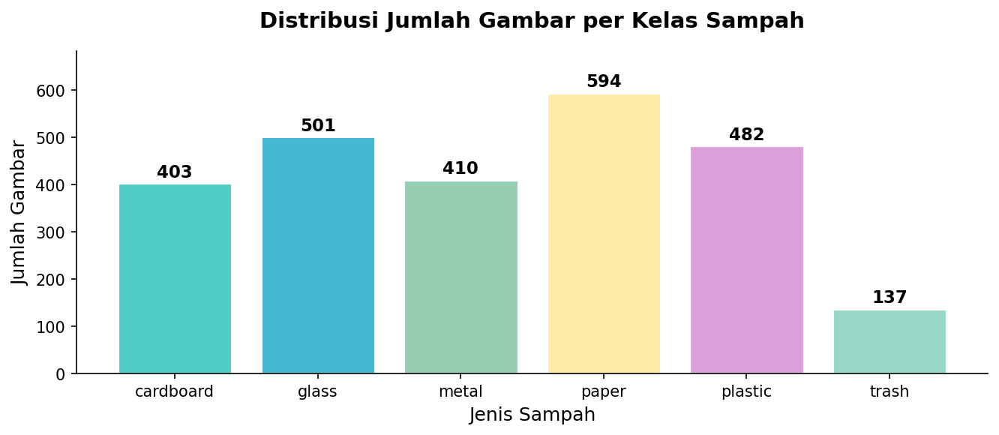
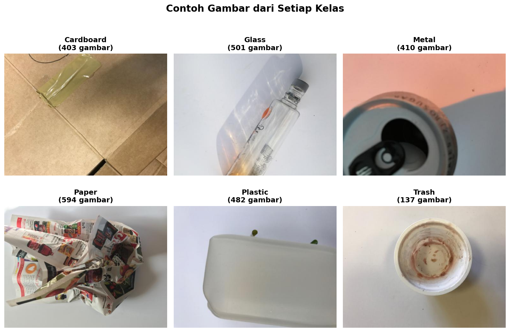
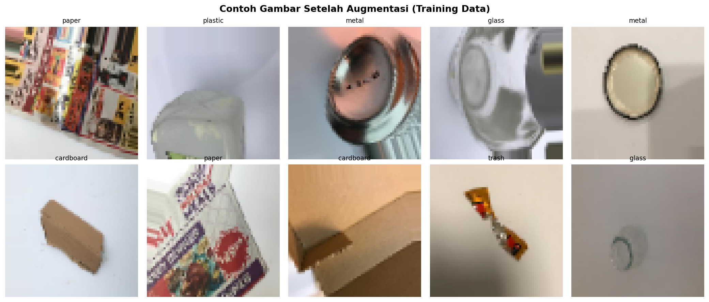
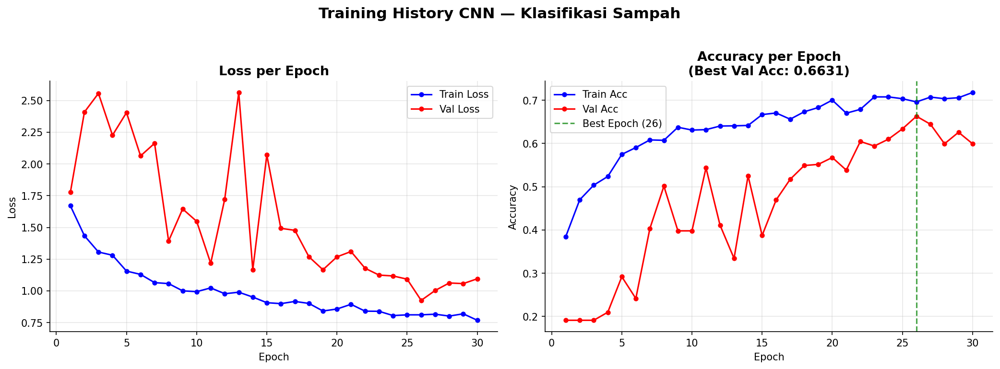
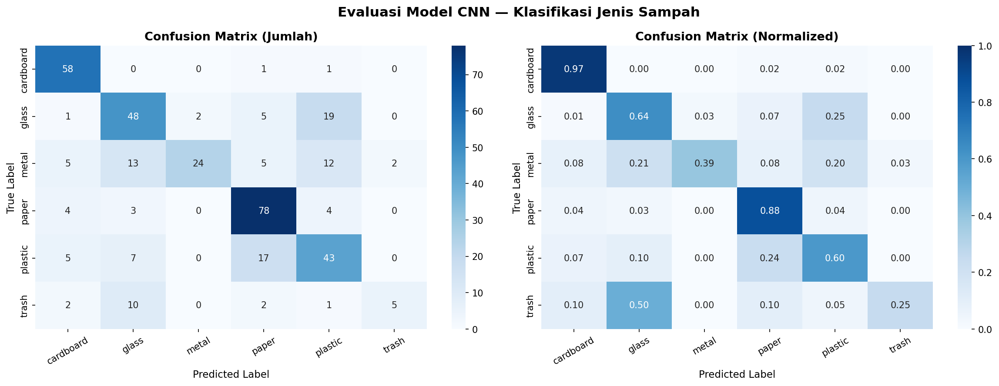
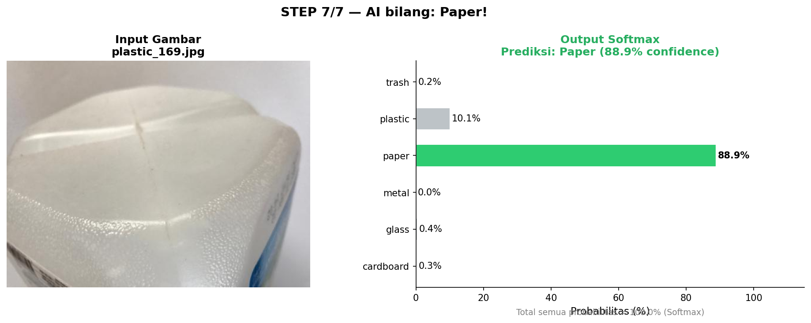
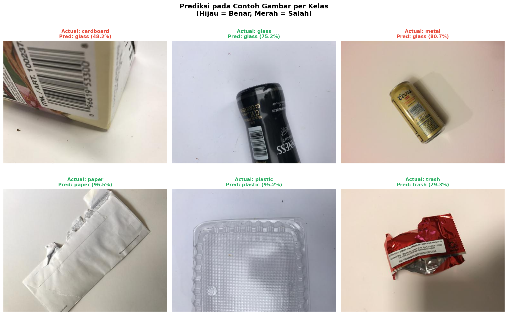

# CNN Trash Type Classification

> **Machine Learning Assignment — Week 10 [CNN]**  
> Klasifikasi jenis sampah menggunakan Convolutional Neural Network (CNN) dengan TensorFlow/Keras.

---

## Deskripsi

Project ini mengimplementasikan CNN dari nol untuk mengklasifikasikan gambar sampah ke dalam 6 kategori. Mengikuti alur lengkap: **dari foto sampah masuk sampai AI bilang "ini plastik"** — step by step.

Alur CNN yang diimplementasikan:

```
Input → Conv → ReLU → Pool → Flatten → FC → Output (Softmax)
```

---

## 📂 Struktur Folder

```
Week-10 [CNN]/
│
├── archive/
│   └── TrashType_Image_Dataset/
│       ├── cardboard/
│       ├── glass/
│       ├── metal/
│       ├── paper/
│       ├── plastic/
│       └── trash/
│
├── CNN_Trash_Classification.ipynb   ← notebook utama
├── best_model.keras                 ← model terbaik (disimpan otomatis saat training)
├── CNN_TrashClassifier_final.keras  ← model final setelah training selesai
│
├── distribusi_kelas.png             ← grafik distribusi jumlah gambar per kelas
├── contoh_gambar.png                ← contoh gambar dari setiap kelas
├── augmentasi.png                   ← contoh hasil augmentasi data
├── step1_pixel_matrix.png           ← visualisasi gambar sebagai matriks angka
├── training_history.png             ← grafik loss & accuracy selama training
├── confusion_matrix.png             ← confusion matrix hasil evaluasi
├── prediksi_output.png              ← contoh output prediksi satu gambar
└── prediksi_grid.png                ← prediksi pada contoh gambar per kelas
```

---

## 📊 Dataset

- **Sumber:** [Trash Type Image Dataset — Kaggle](https://www.kaggle.com/datasets/farzadnekouei/trash-type-image-dataset)
- **Total gambar:** 2.527 gambar
- **Jumlah kelas:** 6

| Kelas | Jumlah | Proporsi |
|-------|--------|----------|
| cardboard | 403 | 15.9% |
| glass | 501 | 19.8% |
| metal | 410 | 16.2% |
| paper | 594 | 23.5% |
| plastic | 482 | 19.1% |
| trash | 137 | 5.4% |





---

## Arsitektur Model

Model CNN custom dengan 4 Convolutional Block + Fully Connected layers:

```
Input (64×64×3)
  ↓ Conv2D(32)  → BatchNorm → ReLU → MaxPool(2×2) → Dropout(0.25)
  ↓ Conv2D(64)  → BatchNorm → ReLU → MaxPool(2×2) → Dropout(0.25)
  ↓ Conv2D(128) → BatchNorm → ReLU → MaxPool(2×2) → Dropout(0.30)
  ↓ Conv2D(256) → BatchNorm → ReLU → GlobalAvgPool
  ↓ Dense(256)  → BatchNorm → ReLU → Dropout(0.50)
  ↓ Dense(128)  → BatchNorm → ReLU → Dropout(0.40)
  ↓ Dense(6, Softmax)  ← Output probabilitas 6 kelas
```

Setiap Convolutional Block mengikuti pola alur CNN yang diajarkan:

| Step | Layer | Fungsi |
|------|-------|--------|
| 1 | Input | Gambar dipecah jadi matriks angka 0–255 |
| 2 | Conv2D | Filter 3×3 menggeser gambar, deteksi tepi & pola |
| 3 | Feature Map | Hasil konvolusi — layer awal ngenali garis & tepi |
| 4 | ReLU | Buang nilai negatif, fokus ke sinyal penting |
| 5 | MaxPooling | Ambil nilai terbesar tiap area 2×2, kompres 75% |
| 6 | Flatten → FC | Ubah 2D jadi array 1D, lalu ke Dense layer |
| 7 | Softmax | Output probabilitas per kelas, tertinggi = prediksi |

---

## Hyperparameter

| Parameter | Nilai |
|-----------|-------|
| Image Size | 64 × 64 piksel |
| Batch Size | 32 |
| Epochs (max) | 30 |
| Learning Rate | 0.001 (Adam) |
| Validation Split | 15% |
| Optimizer | Adam |
| Loss Function | Categorical Crossentropy |

**Callbacks yang digunakan:**
- `EarlyStopping` — berhenti jika val_accuracy tidak naik selama 7 epoch
- `ReduceLROnPlateau` — kurangi learning rate jika val_loss stagnan
- `ModelCheckpoint` — simpan model terbaik secara otomatis

**Data Augmentasi (training only):**
- Rotasi ±20°, horizontal flip, zoom, shift, shear



---

## 📈 Hasil Training



| Metrik | Nilai |
|--------|-------|
| Validation Accuracy | **67.37%** |
| Training Platform | CPU (Intel) — TensorFlow 2.21.0 |



---

## Contoh Prediksi

Output model berupa probabilitas Softmax untuk setiap kelas. Nilai tertinggi menjadi prediksi akhir.





---

## Cara Menjalankan

### 1. Clone repository & siapkan dataset

```bash
git clone <https://github.com/AruDoon/RE603-MachineLearning-Aldon.git>
cd Week-10 [CNN]
```

Download dataset dari Kaggle lalu ekstrak sehingga strukturnya:
```
archive/TrashType_Image_Dataset/cardboard/...
```

### 2. Install dependencies

```bash
pip install tensorflow matplotlib seaborn scikit-learn pillow
```

### 3. Jalankan notebook

Buka `CNN_Trash_Classification.ipynb` di Jupyter atau VS Code, lalu jalankan semua cell dari atas ke bawah.

> **Catatan:** Sesuaikan `DATASET_DIR` di cell konfigurasi jika path dataset berbeda.

---

Dataset **Garbage Image** dapat di Download melalui tombol di bawah ini: <br>
[](https://www.kaggle.com/datasets/farzadnekouei/trash-type-image-dataset)