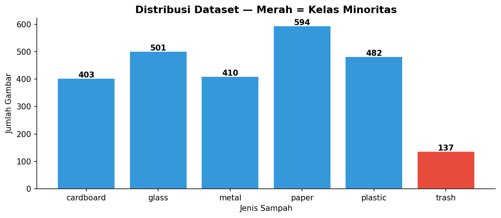
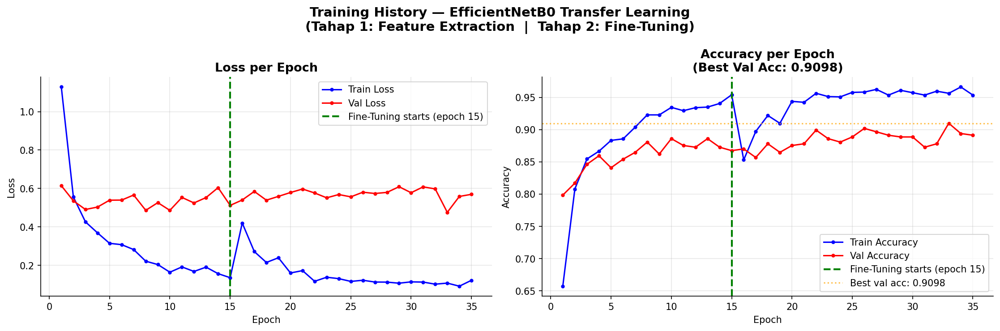
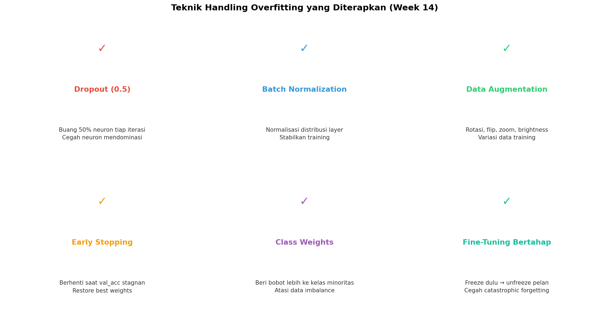
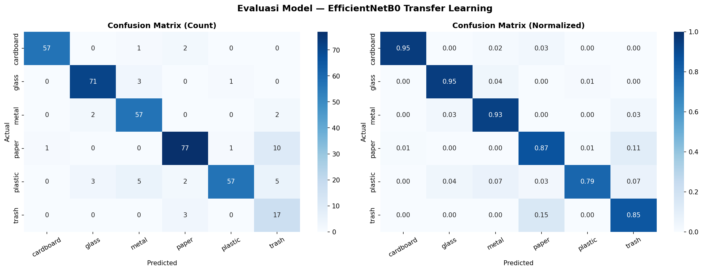
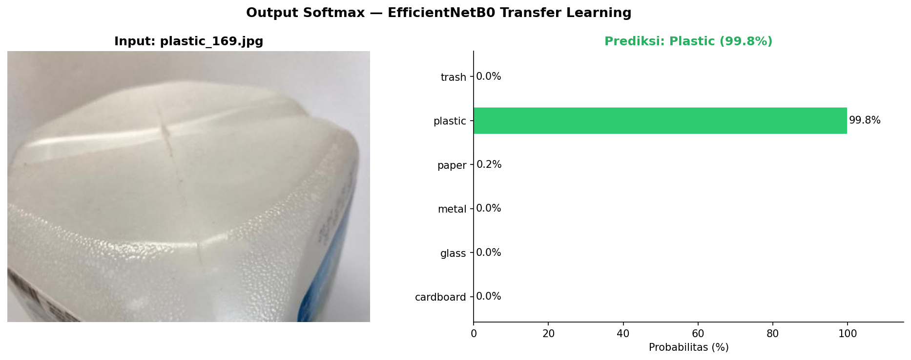
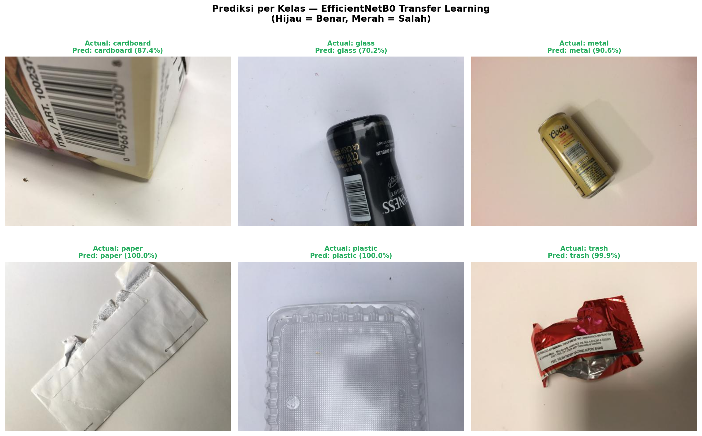

# Image Classification using Transfer Learning
**Deteksi Jenis Sampah di Sekitar Kampus**

> **Machine Learning Assignment — Week 13 & 14**  
> Transfer Learning dengan EfficientNetB0 + Deteksi & Penanganan Overfitting

---

## Deskripsi

Project ini mengimplementasikan **Transfer Learning** menggunakan model pre-trained **EfficientNetB0** (ImageNet) untuk mengklasifikasikan jenis sampah ke dalam 6 kategori, sekaligus mengevaluasi apakah model mengalami overfitting dan menerapkan teknik penanganannya.

### Mengapa Transfer Learning?

| Masalah Deep Learning Tradisional | Transfer Learning |
|----------------------------------|-------------------|
| Butuh jutaan data (ImageNet: 14 juta gambar) | Cukup ribuan data |
| Training 2–4 minggu, 1000+ GPU hours | Training puluhan menit |
| Biaya $10,000+ | Gratis / murah |
| Mudah overfitting pada dataset kecil | Fitur sudah matang dari pre-training |

---

## Struktur Folder

```
Week-13-14[Transfer Learning]/
│
├── archive/
│   └── TrashType_Image_Dataset/
│       ├── cardboard/
│       ├── glass/
│       ├── metal/
│       ├── paper/
│       ├── plastic/
│       └── trash/
│
├── Transfer_Learning_Trash_Classification.ipynb  ← notebook utama
├── best_model_stage1.keras                       ← model terbaik Tahap 1
├── best_model_stage2.keras                       ← model terbaik Tahap 2
└──  EfficientNetB0_TrashClassifier_final.keras   ← model final
```

---

## 📊 Dataset

- **Sumber:** [Trash Type Image Dataset — Kaggle](https://www.kaggle.com/datasets/farzadnekouei/trash-type-image-dataset)
- **Total gambar:** 2.527
- **Jumlah kelas:** 6

| Kelas | Jumlah | Proporsi |
|-------|--------|----------|
| cardboard | 403 | 15.9% |
| glass | 501 | 19.8% |
| metal | 410 | 16.2% |
| paper | 594 | 23.5% |
| plastic | 482 | 19.1% |
| **trash** | **137** | **5.4%** ⚠️ Minoritas |

> **Imbalance ratio: 4.3x** (paper vs trash) — ditangani dengan `class_weight='balanced'`



---

## Arsitektur Model — EfficientNetB0 Transfer Learning

```
Input (224×224×3)
  ↓
EfficientNetB0 [Pre-trained ImageNet, 238 layers]
  ↓
GlobalAveragePooling2D
  ↓
BatchNormalization
  ↓
Dense(256) → ReLU → Dropout(0.5)
  ↓
Dense(6, Softmax)  ← Output 6 kelas
```

### Strategi: 2-Tahap Fine-Tuning (sesuai materi Week 13)

| | Tahap 1 — Feature Extraction | Tahap 2 — Fine-Tuning |
|-|-------------------------------|------------------------|
| **Metode** | Fixed Feature Extractor | Fine-Tuning |
| **Base model** | Frozen (semua 238 layer) | Unfreeze 38 layer terakhir |
| **Yang dilatih** | Head classifier saja | Head + layer 200–238 |
| **Trainable params** | ~40K | 2.382.742 |
| **Learning rate** | 1e-3 | 1e-4 (10× lebih kecil) |
| **Epochs** | 15 (max) | 20 (max) |

---

## Hyperparameter

| Parameter | Nilai |
|-----------|-------|
| Image Size | 224 × 224 piksel |
| Batch Size | 32 |
| Validation Split | 15% |
| LR Tahap 1 | 0.001 (Adam) |
| LR Tahap 2 | 0.0001 (Adam) |
| Fine-Tune dari layer | 200 / 238 |
| Loss Function | Categorical Crossentropy |

---

## Hasil Training



Garis hijau vertikal memisahkan Tahap 1 (Feature Extraction) dan Tahap 2 (Fine-Tuning).

| Metrik | Nilai |
|--------|-------|
| **Best Validation Accuracy** | **90.98%** |
| Final Train Accuracy | 95.35% |
| Final Val Accuracy | 89.12% |
| Final Train Loss | 0.1223 |
| Final Val Loss | 0.5697 |
| Training Platform | CPU — Intel i5 Gen 13, TensorFlow 2.21.0 |

---

## Week 14 — Deteksi & Penanganan Overfitting

### Diagnosis

| Kondisi | Train Acc | Val Acc | Diagnosis |
|---------|-----------|---------|-----------|
| Underfitting | 60% | 65% | Sama-sama rendah |
| Just Right | 85% | 82% | Gap kecil (normal) |
| Overfitting | 99% | 65% | **Gap besar!** |
| **Model Ini** | **95%** | **89%** | **✅ JUST RIGHT** |

**Gap accuracy: 6.22% ≤ 10% → Model generalisasi dengan baik, tidak overfitting.**

### Teknik Anti-Overfitting yang Diterapkan



| Teknik | Implementasi |
|--------|-------------|
| **Dropout** | Rate 0.5 di head classifier |
| **Batch Normalization** | Di head classifier |
| **Data Augmentation** | Rotasi ±30°, flip, zoom, brightness |
| **Early Stopping** | patience=7, restore best weights |
| **ReduceLROnPlateau** | factor=0.5, patience=3 |
| **Class Weights** | Balanced — tangani imbalance trash (137 img) |
| **Fine-Tuning Bertahap** | Freeze → unfreeze pelan, cegah catastrophic forgetting |

---

## Evaluasi Model



---

## Contoh Prediksi





---

## Cara Menjalankan

**1. Clone repo & siapkan dataset**
```bash
git clone <repo-url>
cd Week-13-14[Transfer\ Learning]
```

Download dataset dari Kaggle, ekstrak sehingga strukturnya:
```
archive/TrashType_Image_Dataset/cardboard/...
```

**2. Install dependencies**
```bash
pip install tensorflow matplotlib seaborn scikit-learn pillow
```

**3. Jalankan notebook**

Buka `Transfer_Learning_Trash_Classification.ipynb` lalu Run All.

> Sesuaikan `DATASET_DIR` di cell konfigurasi jika path berbeda.

---
