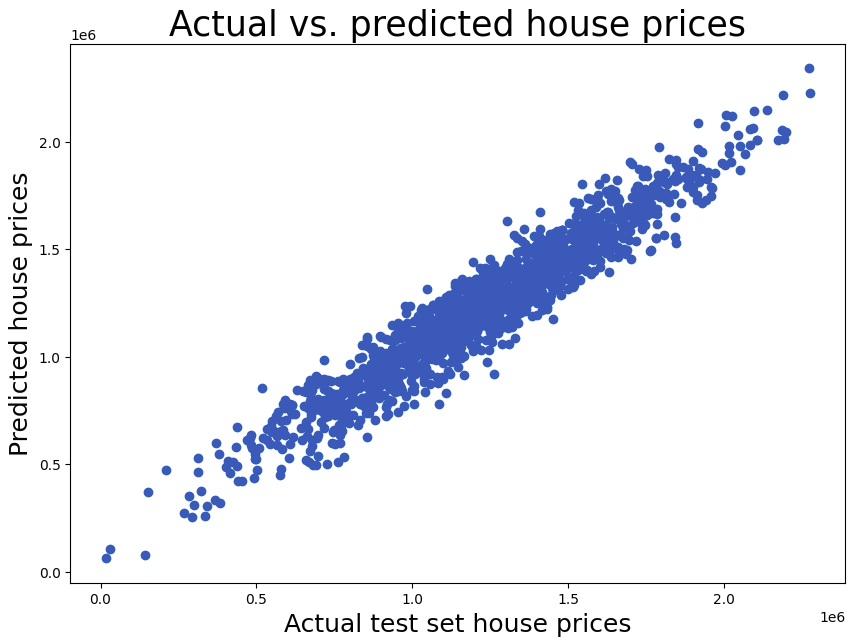

# WEEK-4 Regresi Linear

Membahas tentang Regresi Linear dalam Supervised Learning.  

Tujuan utama regresi: Membangun model yang dapat memprediksi variabel target (dependen) berdasarkan satu atau lebih variabel independen (fitur).

Dataset yang digunakan:

- USA_Housing.csv

### Fitur-Fitur Regresi Linear Yang Digunakan
- Linear Regression
- Residuals
- Multiple Linear Regressionon
- Polynomial Regression
- Bias-Variance Tradeoff
- Regularization Techniques
- Robust Regression
- Poisson Regression

---

### Hasil Pengerjaan Tugas

| Metrik | Nilai |
|------|------|
| MAE | 81739.77482718184 |
| RMSE | 102418.93543581179 |
| R-squared test | 0.919 |

### visualisasi Metrik 
