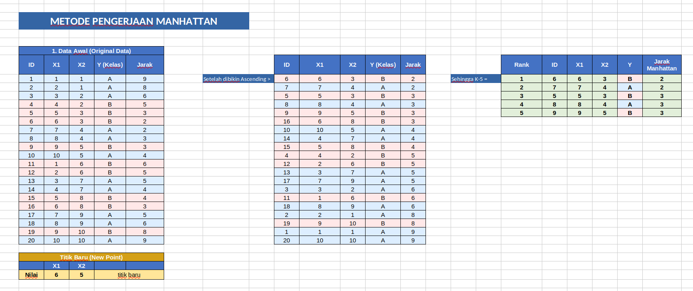

# WEEK-5 KNN

Membahas tentang Pengklasifikasian data berdasarkan set data terdekan .  

Tujuan utama regresi: Membangun model yang dapat memprediksi variabel target (dependen) berdasarkan satu atau lebih variabel independen (fitur).

Dataset yang digunakan:
- titanic.csv

---

### Hasil Pengerjaan Tugas [Assignment-4]

