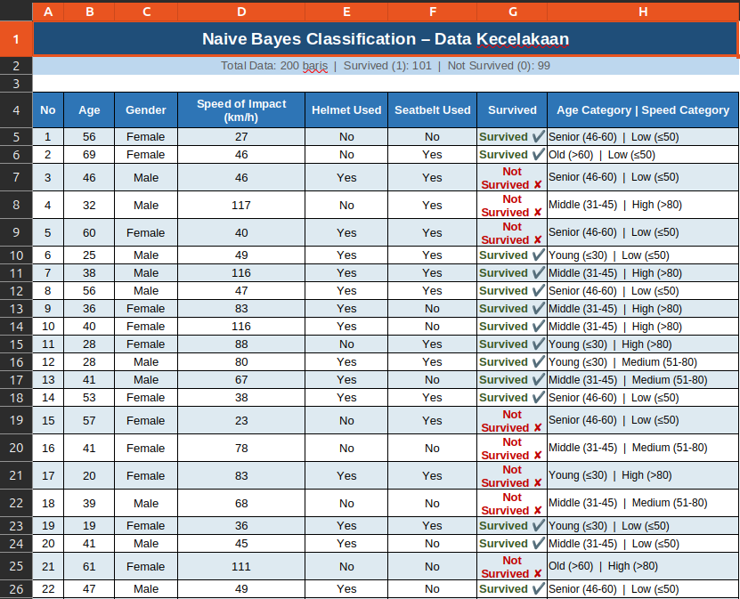
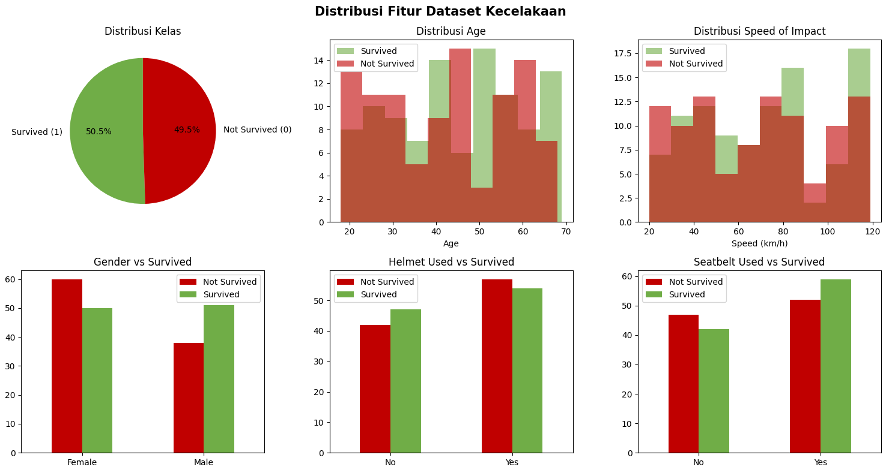
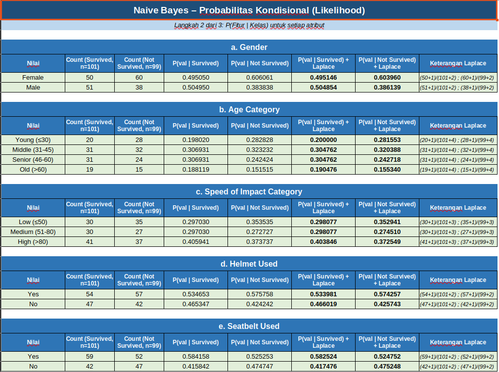

# WEEK-6 Naive Bayes + KNN + Decision Tree 

Di minggu ini kami berfokus pada penggunaan meode Naive Bayes menggunakan bantuan aplikasi Excell untu menyortir dan membuat prediksi berdasarkan hasil sortiran data yang sudah dikumpulkan.  

Dataset yang digunakan masih sama, yaitu:
- `titanic.csv`

 

# WEEK-6 GROUP-ASSIGNMENT [NAIVE BAYES]

Setelah pengerjaan Practice Week 6 ini, kami juga diberikan group assignment yangdimana kami harus menyediakan sebuah power point presentation dengan setidaknya 3 metode yang berbeda dari semua metode machine learning yang sudah kami pelajari sampai kini.  

Di kelomok **Team-4** saya berfokus pada pengerjaan metode **"Naive Bayes"** dan untuk dataset yang kami gunakan adalah dataset hasil kecelakaan dari 200 orang yang dimana dari 200 orang ini berisi banyak variable berbeda, dataset ini bernama: 
- `accident.csv`. 

 

Berikut dibawah ini adalak Kelas dan Fitur dari dataset `accidents.csv`
 

 

Dan berikut adalah hasil distribusi data *(yang selamat dan yang tidak selamat)*

 

Dibawah ini adalah hasil perhitungan probabilitas Naive Bayes yang saya dapatkan menggunakan [**Excell**](https://www.youtube.com/watch?v=dQw4w9WgXcQ).

 

Untuk selengkapnya, dapat pulda dilihat File Presentasi dengan menekan tombol dibawah ini:

