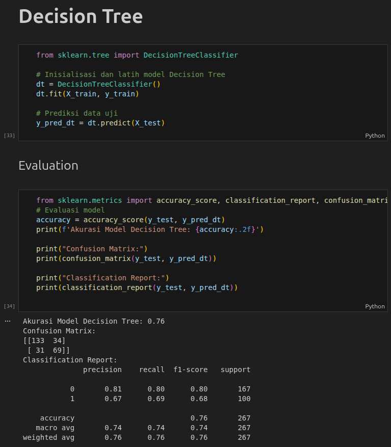

# WEEK-7 DEECISION TREE

File `.ipynb` yang digunakan untuk prectice minggu ketujuh ini masih sama dengan minggu-minggu sebelumnya namun disini lebih berfokus ke Decision Tree.  

Dataset yang digunakan masih sama yaitu:
- `titanic.csv`

Untuk hasill pengerjaan tugas yang dilakukan dalam week ini dapat dilihat pada file:
`Week_5_6_7_Supervised_Learning_Hands_On_Classification_All_tanpa_tuning.ipynb`

---

### Hasil Pengerjaan Tugas [Assignment-6 WEEK-7]

Dapat dilihat dari gambar diatas, hasil output prediksi machine menggunakan algoritma/metode **Decision Tree** mendapatkan akurasi sebesar `0.76` atau **76%** 