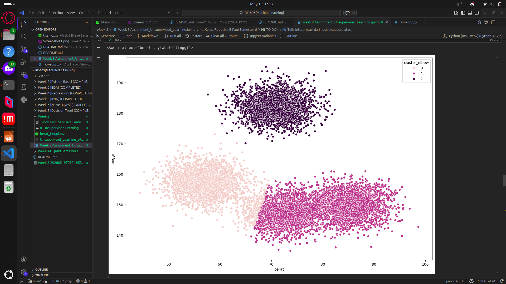
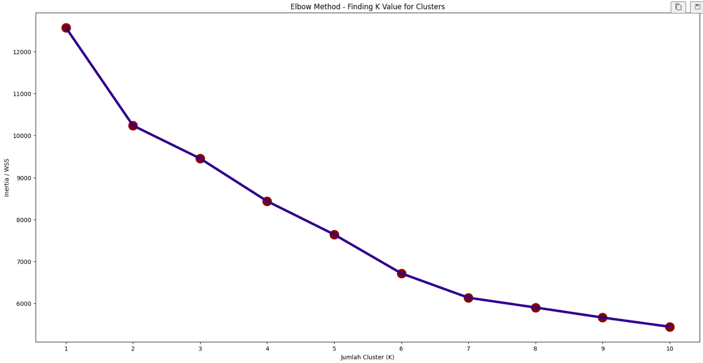
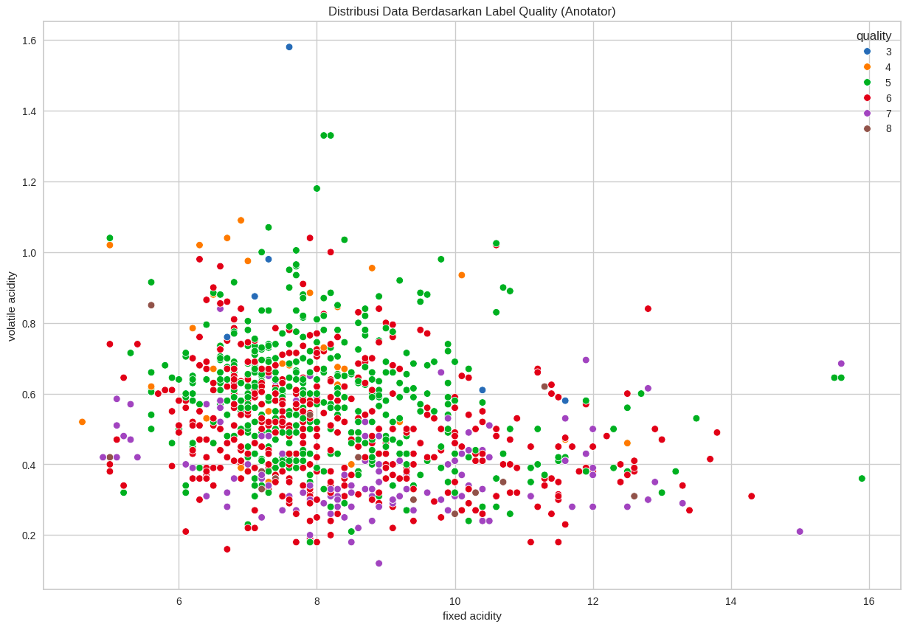
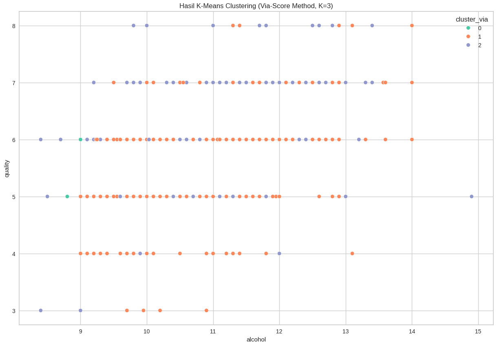

# WEEK-8 Unsupervised Learning
Dataset yang digunakan:
- `berat_tinggi.csv`

 

# WEEK-8 [UNSUPERVISED LEARNING]

Di dalam Week-8 ini kami ditugaskan untuk mengerjakan tugas Unsupervised Learning yang dimana sekarang ini kami berfokus kepada pengaplikasian  **K-Means Clustering** unsupervised learning dengan 2 metode yaitu (Metode Elbow dan Metode Score-Plot).  

 

Berikut dibawah ini adalah salah satu screenshot hasil pengerjaan assignment saya. `berat_tinggi.csv`
 

# ASSIGNMENT-6 Wine Quality Dataset

Setelah melakukan practice harian, adapula assignment 6 yang diberikan yang dimana disini kami melakukan hal yang sama yaitu menggunakan Unsupervised Learning seperti pada practice harian yang dilakukan namun menggunakan dataset yang berbeda yaitu `WineQT.csv` dan berikut dibawah ini adaalah hasil ringkas pengerjaan saya.

 
Di atas adalah hasil Elbow Projection yang saya dapatkan dari dataset WineQT yang dimana disini saya memilih titik elbow ketiga `n_clusters=3` sebagai titik `kmeans` saya.

 

Kedua gambar diatas adalah hasil perbandingan Anotator yang saya dapatkan dan dapat dilihat lebih jelas juga pada bagian hasil distribusi dibawah ini:

### Hasil Distribusi 
Distribusi cluster (Elbow):  
cluster_elbow  
1    720  
2    390  
0     33  
Name: count, dtype: int64  

Distribusi cluster (Via-Score):  
cluster_via  
1    720  
2    390  
0     33  
Name: count, dtype: int64  

Distribusi quality asli:  
quality  
3      6  
4     33  
5    483  
6    462  
7    143  
8     16  
Name: count, dtype: int64  

## Conclusion Hasil
### Interpretasi Hasil Via-Score Method:

1. **Proses clustering berhasil** mengelompokkan data wine ke dalam cluster berdasarkan kemiripan karakteristik kimia (kadar alkohol, keasaman, sulfur, dll), bukan berdasarkan label quality secara langsung — sesuai dengan sifat unsupervised learning.

2. **Cluster 0** mengelompokkan wine dengan karakteristik kimia tertentu, misalnya kadar alkohol sedang dan total sulfur dioxide tinggi.

3. **Cluster 1** mengelompokkan wine dengan keasaman yang lebih tinggi (volatile acidity & fixed acidity lebih besar).

4. **Cluster 2** mengelompokkan wine dengan kadar alkohol lebih tinggi yang umumnya berkorelasi dengan kualitas yang lebih baik.

5. Meskipun label `quality` tidak digunakan saat training, terdapat keterkaitan antara hasil cluster dan distribusi quality — ini menunjukkan bahwa fitur kimia memiliki pola yang berkorelasi dengan kualitas wine secara alami.

### Directory
Untuk file pengerjaan Assignment-6 dapat dilihhat di dalam file:   `WineQuality_Aldon/Assignment_WineQuality_Aldon.ipynb`